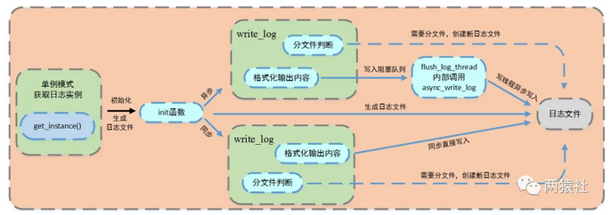

# 基础知识
-- 日志，由服务器自动创建，并记录运行状态，错误信息，访问数据的文件。
-- 同步日志，日志写入函数与工作线程串行执行，由于涉及到I/O操作，当单条日志比较大的时候，同步模式会阻塞整个处理流程，服务器所能处理的并发能力将有所下降，尤其是在峰值的时候，写日志可能成为系统的瓶颈。
-- 生产者-消费者模型，并发编程中的经典模型。以多线程为例，为了实现线程间数据同步，生产者线程与消费者线程共享一个缓冲区，其中生产者线程往缓冲区中push消息，消费者线程从缓冲区中pop消息。
-- 阻塞队列，将生产者-消费者模型进行封装，使用循环数组实现队列，作为两者共享的缓冲区。
-- 异步日志，将所写的日志内容先存入阻塞队列，写线程从阻塞队列中取出内容，写入日志。
-- 单例模式，最简单也是被问到最多的设计模式之一，保证一个类只创建一个实例，同时提供全局访问的方法。
# 内容
本项目中，使用单例模式创建日志系统，对服务器运行状态、错误信息和访问数据进行记录，该系统可以实现按天分类，超行分类功能，可以根据实际情况分别使用同步和异步写入两种方式。
其中异步写入方式，将生产者-消费者模型封装为阻塞队列，创建一个写线程，工作线程将要写的内容push进队列，写线程从队列中取出内容，写入日志文件。
日志系统大致可以分成两部分，其一是单例模式与阻塞队列的定义，其二是日志类的定义与使用。
单例模式作为最常用的设计模式之一，保证一个类仅有一个实例，并提供一个访问它的全局访问点，该实例被所有程序模块共享。
单例模式：
实现思路：私有化它的构造函数，以防止外界创建单例类的对象；使用类的私有静态指针变量指向类的唯一实例，并用一个公有的静态方法获取该实例。
单例模式有两种实现方法，分别是懒汉和饿汉模式。
------------
懒汉模式，即非常懒，不用的时候不去初始化，所以在第一次被使用时才进行初始化；
饿汉模式，即迫不及待，在程序运行时立即初始化。
------------
-- 使用双检测锁模式：如果只检测一次，在每次调用获取实例的方法时，都需要加锁，这将严重影响程序性能。双层检测可以有效避免这种情况，仅在第一次创建单例的时候加锁，其他时候都不再符合NULL == p的情况，直接返回已创建好的实例。
C++11线程安全的局部静态变量
```c
static single* getinstance() {
    static single instance;
    return &instance;
}
```
-- 饿汉模式    
-- 缺点：在于非静态对象（函数外的static对象）在不同编译单元中的初始化顺序是未定义的。如果在初始化完成之前调用 getInstance() 方法会返回一个未定义的实例。

-- 条件变量
-- 使用前要加锁，为什么要加锁？
多线程访问，为了避免资源竞争，所以要加锁，使得每个线程互斥的访问公有资源。
-- pthread_cond_wait内部为什么要解锁？
如果while或者if判断的时候，满足执行条件，线程便会调用pthread_cond_wait阻塞自己，此时它还在持有锁，如果他不解锁，那么其他线程将会无法访问公有资源。
具体到pthread_cond_wait的内部实现，当pthread_cond_wait被调用线程阻塞的时候，pthread_cond_wait会自动释放互斥锁。
-- 为什么要把调用线程放入条件变量的请求队列后再解锁？
线程是并发执行的，如果在把调用线程A放在等待队列之前，就释放了互斥锁，这就意味着其他线程比如线程B可以获得互斥锁去访问公有资源，这时候线程A所等待的条件改变了，但是它没有被放在等待队列上，导致A忽略了等待条件被满足的信号。
倘若在线程A调用pthread_cond_wait开始，到把A放在等待队列的过程中，都持有互斥锁，其他线程无法得到互斥锁，就不能改变公有资源。
-- 为什么最后还要加锁？
将线程放在条件变量的请求队列后，将其解锁，此时等待被唤醒，若成功竞争到互斥锁，再次加锁。
-- 为什么判断线程执行的条件用while而不是if？
需要持续的等待，用if会进行下一步
一般来说，在多线程资源竞争的时候，在一个使用资源的线程里面（消费者）判断资源是否可用，不可用，便调用pthread_cond_wait，在另一个线程里面（生产者）如果判断资源可用的话，则调用pthread_cond_signal发送一个资源可用信号。
在wait成功之后，资源就一定可以被使用么？答案是否定的，如果同时有两个或者两个以上的线程正在等待此资源，wait返回后，资源可能已经被使用了。
再具体点，有可能多个线程都在等待这个资源可用的信号，信号发出后只有一个资源可用，但是有A，B两个线程都在等待，B比较速度快，获得互斥锁，然后加锁，消耗资源，然后解锁，之后A获得互斥锁，但A回去发现资源已经被使用了，它便有两个选择，一个是去访问不存在的资源，另一个就是继续等待，那么继续等待下去的条件就是使用while，要不然使用if的话pthread_cond_wait返回后，就会顺序执行下去。
所以，在这种情况下，应该使用while而不是if。

-- 阻塞队列
阻塞队列类中封装了生产者-消费者模型，其中push成员是生产者，pop成员是消费者。、
阻塞队列中，使用了循环数组实现了队列，作为两者共享缓冲区，当然了，队列也可以使用STL中的queue。
自定义队列
当队列为空时，从队列中获取元素的线程将会被挂起；当队列是满时，往队列里添加元素的线程将会挂起。
# 日志类定义和使用
# 基础API
-- fputs
```c
#include <stdio.h>
int fputs(const char *str, FILE *stream);
```
str，一个数组，包含了要写入的以空字符终止的字符序列。
stream，指向FILE对象的指针，该FILE对象标识了要被写入字符串的流。

-- 可变参数宏__VA_ARGS__
__VA_ARGS__是一个可变参数的宏，定义时宏定义中参数列表的最后一个参数为省略号，在实际使用时会发现有时会加##，有时又不加。
__VA_ARGS__宏前面加上##的作用在于，当可变参数的个数为0时，这里printf参数列表中的的##会把前面多余的","去掉，否则会编译出错，建议使用后面这种，使得程序更加健壮。

-- fflush
```c
#include <stdio.h>
int fflush(FILE *stream);
```
fflush()会强迫将缓冲区内的数据写回参数stream 指定的文件中，如果参数stream 为NULL，fflush()会将所有打开的文件数据更新。
在使用多个输出函数连续进行多次输出到控制台时，有可能下一个数据再上一个数据还没输出完毕，还在输出缓冲区中时，下一个printf就把另一个数据加入输出缓冲区，结果冲掉了原来的数据，出现输出错误。
在prinf()后加上fflush(stdout); 强制马上输出到控制台，可以避免出现上述错误。
# 流程

-- 日志文件
局部变量的懒汉模式获取实例
生成日志文件，并判断同步和异步写入方式
-- 同步
判断是否分文件
直接格式化输出内容，将信息写入日志文件
-- 异步
判断是否分文件
格式化输出内容，将内容写入阻塞队列，创建一个写线程，从阻塞队列取出内容写入日志文