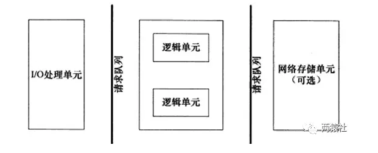

半同步/半反应堆线程池
# 服务器编程基本框架
主要由I/O单元，逻辑单元和网络存储单元组成，其中每个单元之间通过请求队列进行通信，从而协同完成任务。
其中I/O单元用于处理客户端连接，读写网络数据；逻辑单元用于处理业务逻辑的线程；网络存储单元指本地数据库和文件等

# I/O模型
    -- 阻塞IO:调用者调用了某个函数，等待这个函数返回，期间什么也不做，不停的去检查这个函数有没有返回，必须等这个函数返回才能进行下一步动作

    -- 非阻塞IO:非阻塞等待，每隔一段时间就去检测IO事件是否就绪。没有就绪就可以做其他事。非阻塞I/O执行系统调用总是立即返回，不管时间是否已经发生，若时间没有发生，则返回-1，此时可以根据errno区分这两种情况，对于accept，recv和send，事件未发生时，errno通常被设置成eagain

    -- 信号驱动IO:linux用套接口进行信号驱动IO，安装一个信号处理函数，进程继续运行并不阻塞，当IO时间就绪，进程收到SIGIO信号。然后处理IO事件。

    -- IO复用:linux用select/poll函数实现IO复用模型，这两个函数也会使进程阻塞，但是和阻塞IO所不同的是这两个函数可以同时阻塞多个IO操作。而且可以同时对多个读操作、写操作的IO函数进行检测。知道有数据可读或可写时，才真正调用IO操作函数

    -- 异步IO:linux中，可以调用aio_read函数告诉内核描述字缓冲区指针和缓冲区的大小、文件偏移及通知的方式，然后立即返回，当内核将数据拷贝到缓冲区后，再通知应用程序。

-- 注意：同步I/O指内核向应用程序通知的是就绪事件，比如只通知有客户端连接，要求用户代码自行执行I/O操作，异步I/O是指内核向应用程序通知的是完成事件，比如读取客户端的数据后才通知应用程序，由内核完成I/O操作。
# 事件处理模式
-- reactor模式 ：主线程(I/O处理单元)只负责监听文件描述符上是否有事件发生，有的话立即通知工作线程(逻辑单元 )，读写数据、接受新连接及处理客户请求均在工作线程中完成。通常由同步I/O实现。
-- proactor模式：主线程和内核负责处理读写数据、接受新连接等I/O操作，工作线程仅负责业务逻辑，如处理客户请求。通常由异步I/O实现。
# 同步模拟proactor模式
由于异步I/O并不成熟，实际中使用较少，这里将使用同步I/O模拟实现proactor模式。
同步I/O模型的工作流程如下（epoll_wait为例）：
### 网络请求处理流程图

```
┌─────────────────────────────┐
│         主线程启动          │
└────────────┬────────────────┘
             ▼
      创建 socket，bind，listen
             ▼
  注册 socket 的 EPOLLIN（读事件）
             ▼
        epoll_wait 阻塞等待
             ▼
┌────────────┴────────────┐
│    socket 上有数据可读    │◄─────────┐
└────────────┬────────────┘          │
             ▼                       │
     循环 read()，读完请求数据          │
             ▼                       │
  封装为 request 对象，入请求队列        │
             ▼                       │
        唤醒 worker 工作线程           │
             ▼                       │
   业务处理完毕，准备写 socket          │
             ▼                       │
注册该 socket 的 EPOLLOUT（写事件）     │
             ▼                       │
            epoll_wait               │
             ▼                       │
┌────────────┴────────────┐          │
│        socket 可写       │          │
└────────────┬────────────┘          │
             ▼                       │
     主线程 write() 回写响应           │
             ▼                       │
       注销写事件（可选）               │
             ▼                       │
        回到 epoll_wait               ▲
             ▲ ──────────────────────┘
```


相关问题：
-- 主线程不直接处理业务？
    是的，主线程只负责 I/O，不做耗时计算，业务交给 worker。
-- 为什么写事件不一直注册？
    因为 socket 很可能长时间不可写，注册写事件后必须立即写入后注销，否则会持续触发写事件。
-- 为什么读数据后不立即写？
    需要业务逻辑处理，处理可能阻塞或耗时，所以交由工作线程完成。
# 并发编程模式
并发编程方法的实现有多线程和多进程两种，但这里涉及的并发模式指I/O处理单元与逻辑单元的协同完成任务的方法:半同步/半异步模式;领导者/追随者模式
# 半同步/半反应堆
半同步/半反应堆并发模式是半同步/半异步的变体，将半异步具体化为某种事件处理模式。
-- 并发模式中的同步和异步
    同步指的是程序完全按照代码序列的顺序执行
    异步指的是程序的执行需要由系统事件驱动
-- 半同步/半异步模式工作流程
        同步线程用于处理客户逻辑
        异步线程用于处理I/O事件
        异步线程监听到客户请求后，就将其封装成请求对象并插入请求队列中
        请求队列将通知某个工作在同步模式的工作线程来读取并处理该请求对象
-- 半同步/半反应堆工作流程（以Proactor模式为例）
        主线程充当异步线程，负责监听所有socket上的事件
        若有新请求到来，主线程接收之以得到新的连接socket，然后往epoll内核事件表中注册该socket上的读写事件
        如果连接socket上有读写事件发生，主线程从socket上接收数据，并将数据封装成请求对象插入到请求队列中
        所有工作线程睡眠在请求队列上，当有任务到来时，通过竞争（如互斥锁）获得任务的接管权
# 线程池
    空间换时间,浪费服务器的硬件资源,换取运行效率.
    池是一组资源的集合,这组资源在服务器启动之初就被完全创建好并初始化,这称为静态资源.
    当服务器进入正式运行阶段,开始处理客户请求的时候,如果它需要相关的资源,可以直接从池中获取,无需动态分配.
    当服务器处理完一个客户连接后,可以把相关的资源放回池中,无需执行系统调用释放资源.
# 静态成员变量
将类成员变量声明为static，则为静态成员变量，与一般的成员变量不同，无论建立多少对象，都只有一个静态成员变量的拷贝，静态成员变量属于一个类，所有对象共享。
静态变量在编译阶段就分配了空间，对象还没创建时就已经分配了空间，放到全局静态区。
    静态成员变量
        最好是类内声明，类外初始化（以免类名访问静态成员访问不到）。
        无论公有，私有，静态成员都可以在类外定义，但私有成员仍有访问权限。
        非静态成员类外不能初始化。
        静态成员数据是共享的。
# 静态成员函数
将类成员函数声明为static，则为静态成员函数。
静态成员函数
        静态成员函数可以直接访问静态成员变量，不能直接访问普通成员变量，但可以通过参数传递的方式访问。
        普通成员函数可以访问普通成员变量，也可以访问静态成员变量。
        静态成员函数没有this指针。非静态数据成员为对象单独维护，但静态成员函数为共享函数，无法区分是哪个对象，因此不能直接访问普通变量成员，也没有this指针。
```c
int pthread_create (pthread_t *thread_tid,                 //返回新生成的线程的id
                const pthread_attr_t *attr,         //指向线程属性的指针,通常设置为NULL
                void * (*start_routine) (void *),   //处理线程函数的地址
                void *arg); 
```

-- 函数原型中的第三个参数，为函数指针，指向处理线程函数的地址。该函数，要求为静态函数。如果处理线程函数为类成员函数时，需要将其设置为静态成员函数。
-- pthread_create的函数原型中第三个参数的类型为函数指针，指向的线程处理函数参数类型为(void *),若线程函数为类成员函数，则this指针会作为默认的参数被传进函数中，从而和线程函数参数(void*)不能匹配，不能通过编译。静态成员函数就没有这个问题，里面没有this指针。
===============
使用一个工作队列完全解除了主线程和工作线程的耦合关系：主线程往工作队列中插入任务，工作线程通过竞争来取得任务并执行它。
> * 同步I/O模拟proactor模式
> * 半同步/半反应堆
> * 线程池